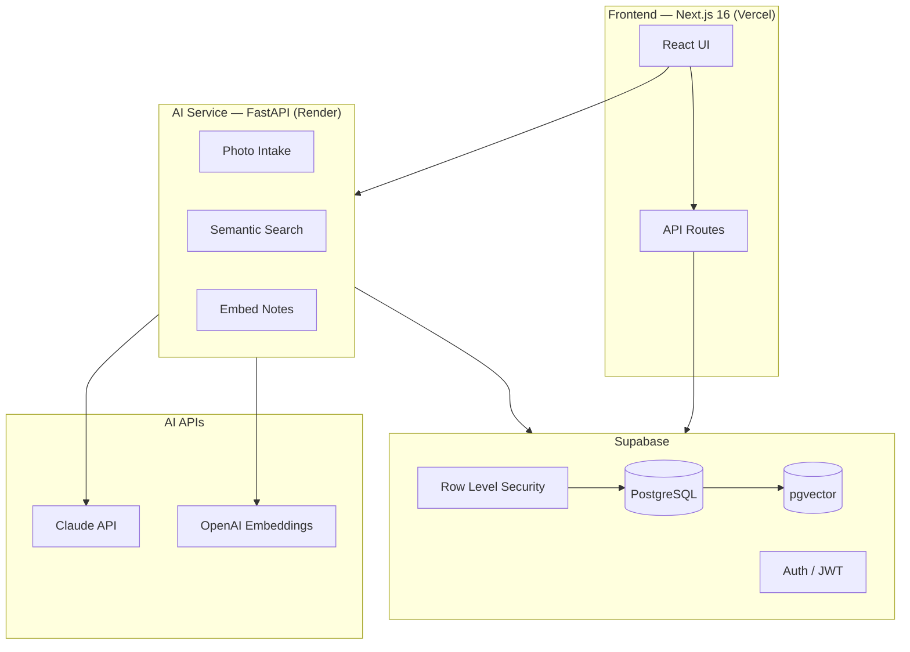
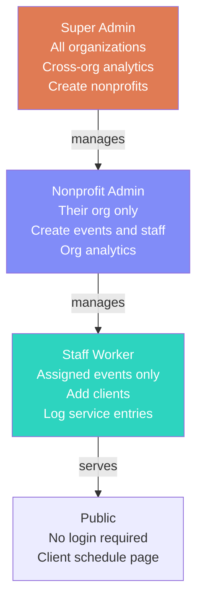
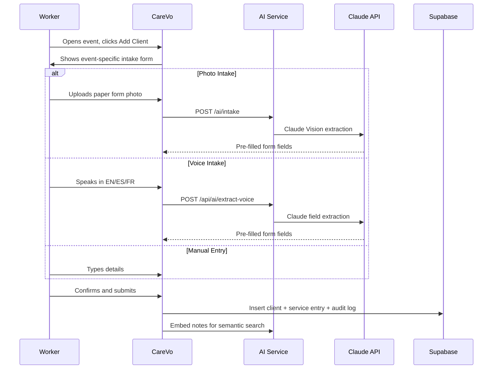
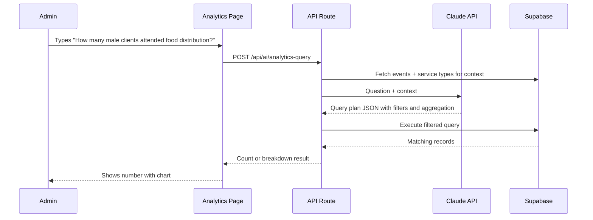
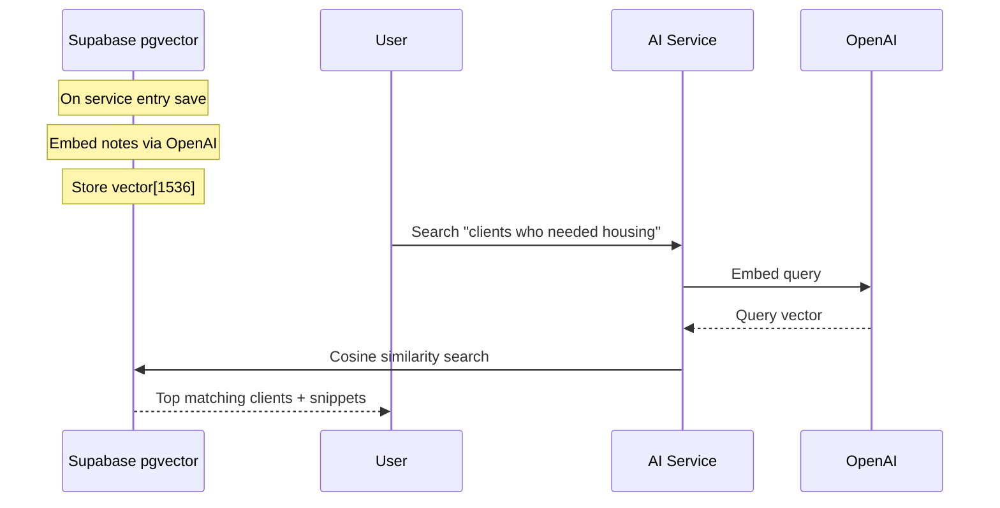
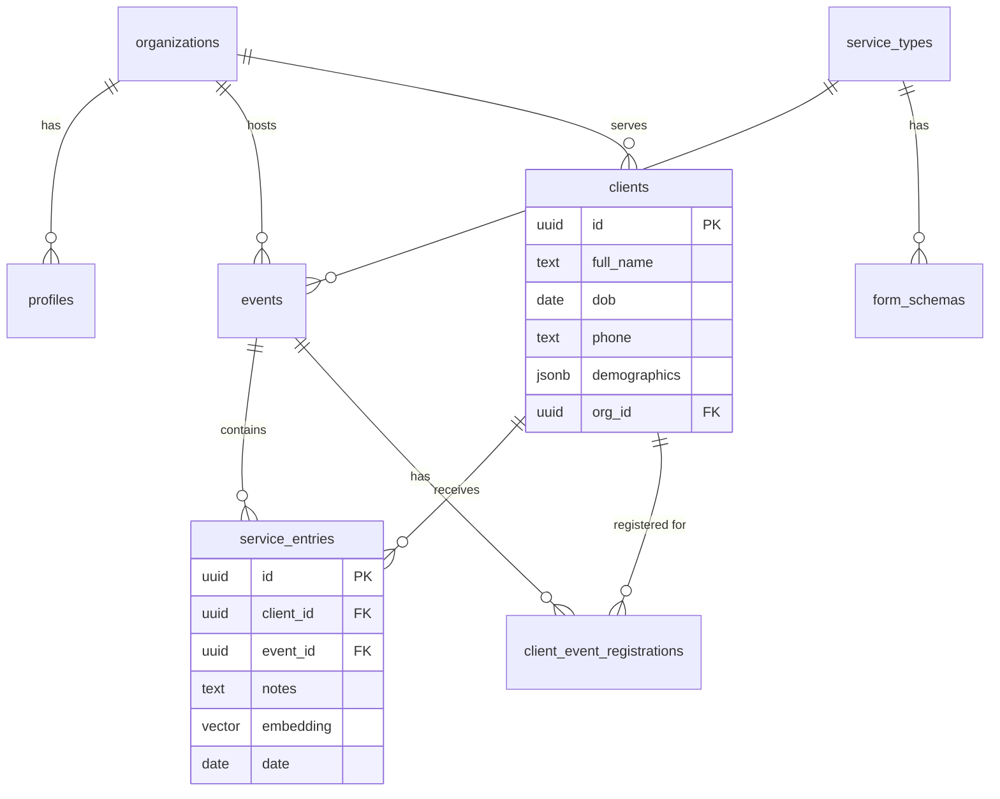

# CareVo — AI-Native Nonprofit Case Management Platform

<div align="center">


**Built at WiCS x Opportunity Hack 2026 · Track 1 · Team Next Wave**

</div>

---

## What is CareVo?

CareVo replaces $2,500–7,500/month enterprise tools like Bonterra Apricot with an AI-native platform that runs for **under $30/month**. Built in 24 hours at Opportunity Hack 2026, addressing problems documented across 9 nonprofits and 7 hackathons.

> 92% of nonprofits operate on budgets under $1M. They use spreadsheets and paper forms, losing data and spending days on grant reports that should take minutes.

---

## Tech Stack

| Layer | Technology | Why |
|-------|-----------|-----|
| Frontend | Next.js 16 (App Router) | Server components, API routes, Vercel deploy |
| AI Service | FastAPI (Python) | Python-native AI ecosystem, isolated rate limiting |
| Database | Supabase (PostgreSQL + pgvector) | Auth + DB + vector search, free tier, RLS |
| AI Vision | Claude Vision (claude-opus-4-5) | Photo-to-intake without custom ML |
| AI Text | Claude API (claude-opus-4-5) | Voice extraction, analytics queries, form generation |
| Embeddings | OpenAI text-embedding-3-small | Semantic search across case notes |
| Vector Search | pgvector (Supabase extension) | No separate vector DB needed |
| Charts | Chart.js + react-chartjs-2 | Analytics visualizations |
| Hosting | Vercel + Render | Free tiers, one-click GitHub deploy |

> **Note on Claude:** Claude was used both as a core product feature (Vision, voice extraction, analytics, form generation) AND as a development assistant for debugging, architecture decisions, and code review throughout this project.

---

## Architecture Overview



---

## User Roles



---

## Client Registration Flow



---

## AI Analytics Flow



---

## Semantic Search Flow



---

## Features

### P0 Core (All Shipped)
- Email/password auth with 3 roles enforced at DB layer via RLS
- Client registration with required fields (name, gender, location)
- Service/visit logging with date and staff attribution
- Client profile with full service history
- Multi-org hierarchy with data isolation
- Event management (create, assign staff, track clients)

### P1 AI Features (All Shipped)

| Feature | How | Cost/use |
|---------|-----|----------|
| Photo-to-Intake | Claude Vision extracts paper form fields | ~$0.01–0.05 |
| Voice Intake | Web Speech API + Claude extraction | ~$0.001–0.01 |
| Semantic Search | OpenAI embeddings + pgvector | ~$0.001 |
| Ask Analytics | Claude NL to structured query | ~$0.002 |
| AI Form Generation | Claude generates fields per service type | ~$0.01 |
| Multilingual | EN/ES/FR toggle and voice | $0 |

### P1 Platform (All Shipped)
- Analytics dashboard (line, bar, doughnut charts) + PDF export
- Client Journey Timeline (visual event history)
- Client Scheduling + public shareable schedule link (no login)
- CSV import/export (flexible schema, any columns)
- Bulk event CSV import for workers
- Audit log for admins
- Duplicate client detection
- Dynamic forms per event type

---

## Database Schema



---

## Setup

### Local Development

```bash
git clone https://github.com/2026-ASU-WiCS-Opportunity-Hack/06-next-wave.git
cd 06-next-wave

# Frontend
cd frontend && npm install && npm run dev

# AI Service (new terminal)
cd ai-service
python -m venv venv && venv/Scripts/activate
pip install -r requirements.txt
uvicorn main:app --reload --port 8000
```

### Environment Variables

**`frontend/.env.local`**
```
NEXT_PUBLIC_SUPABASE_URL=
NEXT_PUBLIC_SUPABASE_ANON_KEY=
NEXT_PUBLIC_AI_SERVICE_URL=http://localhost:8000
ANTHROPIC_API_KEY=
SUPABASE_SERVICE_ROLE_KEY=
```

**`ai-service/.env`**
```
ANTHROPIC_API_KEY=
OPENAI_API_KEY=
SUPABASE_URL=
SUPABASE_SERVICE_KEY=
```

### Supabase Setup
1. Enable pgvector: Database → Extensions → vector
2. Run `supabase/schema.sql` in SQL Editor
3. Run `supabase/seed.sql`
4. `UPDATE profiles SET role = 'super_admin' WHERE email = 'your@email.com'`

### Deploy to Production

**Frontend → Vercel**
- New Project → import repo → Root Directory: `frontend` → add env vars → Deploy

**AI Service → Render**
- New Web Service → root: `ai-service` → start: `uvicorn main:app --host 0.0.0.0 --port $PORT`
- Copy Render URL → set as `NEXT_PUBLIC_AI_SERVICE_URL` in Vercel

---

## Test Credentials

| Email | Role |
|-------|------|
| admin@caretrack.com | Super Admin |
| hpant.data@caretrack.com | Nonprofit Admin (ICM) |
| hardikk@caretrack.com | Nonprofit Admin (Chandler CARE) |
| staff@caretrack.com | Staff (ICM) |

---

## Project Structure

```
nonprofit-cms/
├── frontend/
│   ├── app/
│   │   ├── page.tsx             # Landing page
│   │   ├── dashboard/           # Role-based dashboard
│   │   ├── events/              # Event management
│   │   ├── clients/             # Client management
│   │   │   └── [id]/journey/    # Client timeline
│   │   │   └── [id]/schedule/   # Client scheduling
│   │   ├── admin/               # Admin panel + analytics
│   │   ├── schedule/[clientId]/ # Public schedule (no login)
│   │   └── api/                 # API routes
│   └── components/              # React components
├── ai-service/                  # FastAPI
│   ├── main.py
│   └── routers/
│       ├── intake.py            # Claude Vision
│       └── search.py            # Semantic search
├── supabase/
│   ├── schema.sql
│   └── seed.sql
└── .gitignore
```

---

## Competitive Analysis

| Feature | Bonterra Apricot | CareVo |
|---------|-----------------|--------|
| Monthly cost | $2,500–7,500 | $0–29 |
| Photo-to-Intake AI | No | Yes |
| Voice Intake | No | Yes (3 languages) |
| Semantic Search | Keyword only | pgvector NL |
| Ask Analytics | Basic | Full NL queries |
| Event-Based Workflow | No | Yes |
| Multi-Org Network | No | Yes |
| Open Source | No | Yes (MIT) |

---

## About Claude in This Project

Claude (Anthropic) powered both the product and the development:

**As a product feature:**
- Photo intake via Claude Vision API
- Voice field extraction via Claude text API
- Natural language analytics query interpretation
- Dynamic form generation per service type

**As a development tool:**
- Architecture design (RLS policies, pgvector setup, multi-org hierarchy)
- Debugging complex issues (circular RLS deadlocks, Supabase schema cache errors, Next.js hydration issues)
- Code generation and refactoring
- Writing documentation

The entire platform was built in 24 hours using Claude as a pair programming assistant.

---

## License

MIT — free to use, modify, and distribute.

*Built with love at Opportunity Hack 2026 · [ohack.dev](https://ohack.dev)*
